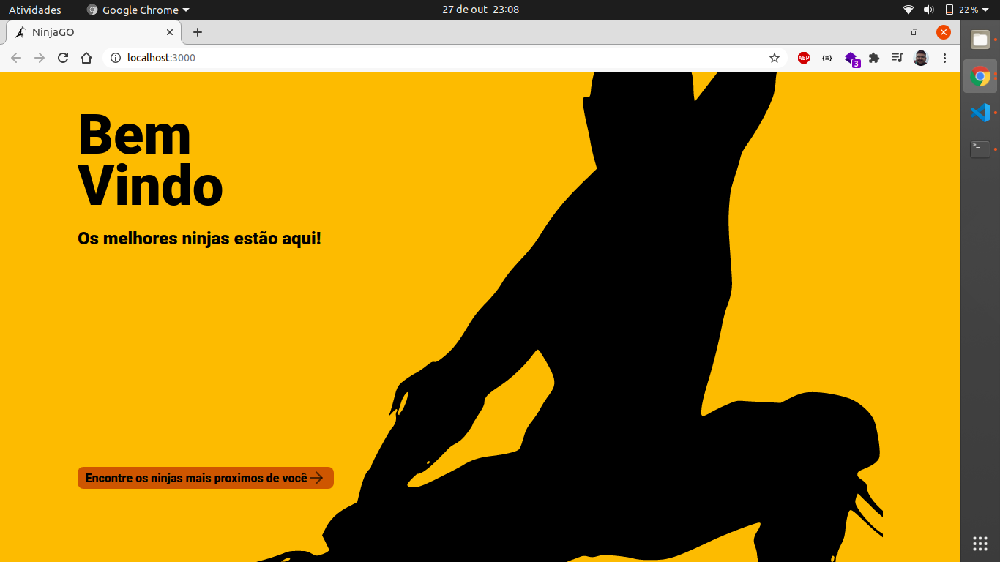

# NinjaGO

# Sobre o NinjaGO

Deseja contratar os serviços dos melhores ninjas mais próximos da sua região, NinjaGo é o site pra você.

# Descrição

Projeto elaborado como trabalho da disciplina Banco de Dados II, do semestre 2020.1, do curso de Ciência da Computação da Universidade Federal de Roraima.

# Tecnologias
- [React] (https://reactjs.org/)
- [NodeJS] (https://nodejs.org/en/)
- [TypeScript] (https://www.typescriptlang.org/)
- [MongoDB] (https://www.mongodb.com/)

# Instalação e uso

### Clone do repositório

```bash
$ git clone https://github.com/millerraycell/ninjaGO.git
```
#### Rodando o Backend da aplicação
```bash
#Com o Mongo já rodando na sua máquina abra um terminal e insira
$ cd ninjaGO/backend

#Caso não tenha no seu computador baixe o programa yarn (https://classic.yarnpkg.com/en/docs/install/)
#Insira o comando para instalar as dependências do projeto (pode demorar)
$ yarn install

#Depois que todas as dependencias forem instaladas insira no terminal
$ yarn dev

#Agora o Backend da aplicação está rodando, e ele irá procurar a coleção designada para o projeto no mongo
```

#### Rodando o Frontend

```bash
#Abra um terminal na pasta raiz do projeto depois insira
$ cd web

#Insira o comando para baixar as dependências do projeto (pode demorar)
$ yarn install

#Insira o comando para iniciar o site
$ yarn start
```

Pronto agora o site está rodando na sua máquina

## Fotos do site

- Página inicial
<p align="center">
    
</p>

- Mapa dos Ninjas próximos

<p align="center">
    
</p>

- Criar um Ninja
    - 1
        <p align="center">
            
        </p>
    - 2
        <p align="center">
            
        </p>
    - 3
        <p align="center">
            
        </p>

- Atualizar dados de um Ninja
    - 1
        <p align="center">
            
        </p>
    - 2
        <p align="center">
            
        </p>
    - 3
        <p align="center">
            
        </p>
    - 4
        <p align="center">
            
        </p>

- Remover o cadastro de um Ninja
    - 1
        <p align="center">
            
        </p>
    - 2
        <p align="center">
            
        </p>
    - 3
        <p align="center">
            
        </p>
    - 4
        <p align="center">
            
        </p>

